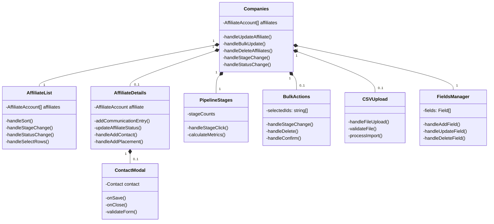

# UML Class Diagram

## Component Relationships

This UML diagram shows:

1. Data Models:
   - Core entities like AffiliateAccount, Contact, PlacementOpportunity
   - Supporting types like CommunicationEntry, Tag, and CustomField
   - Relationships between entities
   - Updated field types and method signatures

2. Services:
   - StorageService for data persistence
   - FieldService for custom field management
   - CSVImportService for handling CSV imports
   - AffiliateService for affiliate management

3. Component Hierarchy:
   - Main Companies component
   - Child components like AffiliateList and AffiliateDetails
   - Modal components like ContactModal
   - New components like BulkActions and FieldsManager

4. Key relationships and cardinality between components and entities

5. Updated method signatures and properties to match current implementation